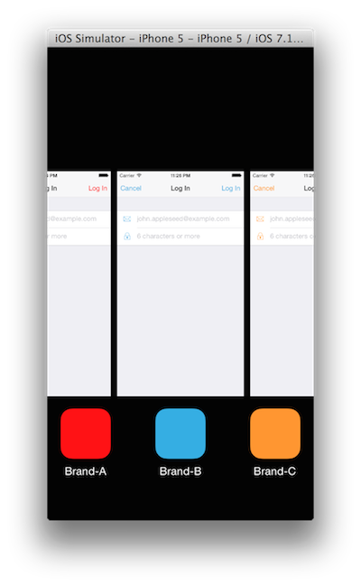

# Branded

Branded is an application that demonstrates how to generate multiple iOS
apps from the same code base. Each app can be configured separately to provide
a different theme (color, images, etc.) that differentiates it from other apps
generated from the same code base. It is also possible to configure other aspects
of the app that are not visible to the users such as:

* Root API URL
* App metadata, e.g., Bundle identifier, bundle display name, app version, etc.
* Device family and minimum iOS version required

This is possible because each app has its own target. As a result, anything that
can be configured via [Info.plist](http://goo.gl/QgfMhM) is readily available for
customization just by using a separate Info.plist file for each target.

Figure below shows three different apps that were generated from this code base.

Building
---------

Clone the repository, then run `pod install` from [terminal](http://en.wikipedia.org/wiki/Terminal_(OS_X).
Once all pods specified in the [Podfile](http://guides.cocoapods.org/syntax/podfile.html)
are installed, open the `Branded.xcworkspace` file in Xcode and run (⌘R).
