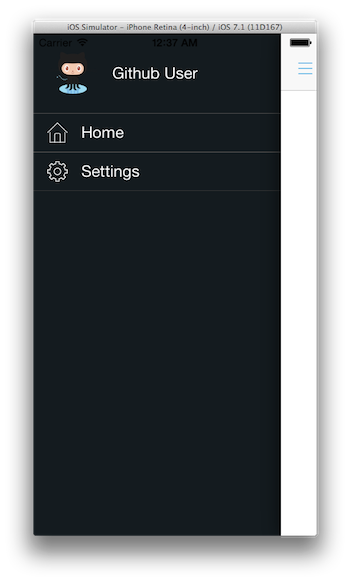
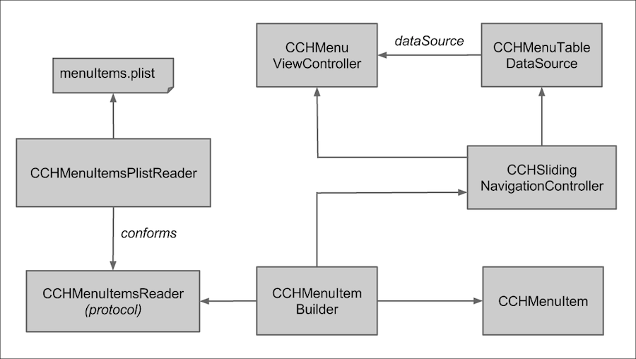

# App Menu

This app allows selection of available features from a menu as shown in the
figure below.

This document explains:

* [How the menu gets created](#how_menu_gets_created)
* [How disabled features get removed from the menu](#how_disabled_features_get_removed)

<a name="how_menu_gets_created"/>
How the menu gets created
-------------------------

The metadata needed to create and display each menu item is stored in `CCHMenuItem`
model objects. For a menu item to be considered fully functional, *title*, *icon*
and *tap event handler* must be present. If the app is universal (i.e. designed
for both iPhone and iPad), a separate tap event handler might be needed for each
device family.

`CCHMenuItemsPlistReader` reads the metadata for menu items from a plist file.
`CCHMenuItemBuilder` then takes the metadata and creates a `CCHMenuItem` object
for each menu item. `CCHSlidingNavigationController` passes a list of all
`CCHMenuItem` objects returned by `CCHMenuItemBuilder` to `CCHMenuTableDataSource`
which is responsible for providing data such as number of sections, number of
rows in each section and cells for each row to the table view that displays menu
items. `CCHMenuViewController` facilitates all interactions between the table
view and its data source in addition to managing the lifecycle of menu view itself.

Once the menu view has been displayed, `CCHMenuViewController` waits for the
arrival of `MDMenuTableDataSourceDidSelectItemNotification`. When that notification
arrives, it creates an instance of the tap event handler class specified in
`CCHMenuItem` object and sets that instance as a new top view controller.
Currently, we require the tap event handler class to be a subclass of
[UIViewController](http://goo.gl/p5QzS4).

**Note:** Rest of the behaviors present in menu view, for example sliding the
top view in and out are provided by `ECSlidingViewController` library. See the
[github page](http://goo.gl/DjBTFw) for that library to understand how it works.

Figure below shows the relationship between classes involved in displaying and
handling events related to menu items. The app menu architecture takes advantage
of the [Strategy pattern](http://en.wikipedia.org/wiki/Strategy_pattern) to allow
you to switch `CCHMenuItemsPlistReader` object with any other object that conforms
to `CCHMenuItemsReader` protocol at runtime. For example, if the metadata for menu
items will be read from a remove server in the future, all we will need to do is
pass an instance of `CCHMenuItemsServerReader` (a hypothetical class at this
time) to `CCHMenuItemBuilder` and everything should work just fine.

<a name="how_disabled_features_get_removed"/>
How disabled features get removed from the menu
-----------------------------------------------
